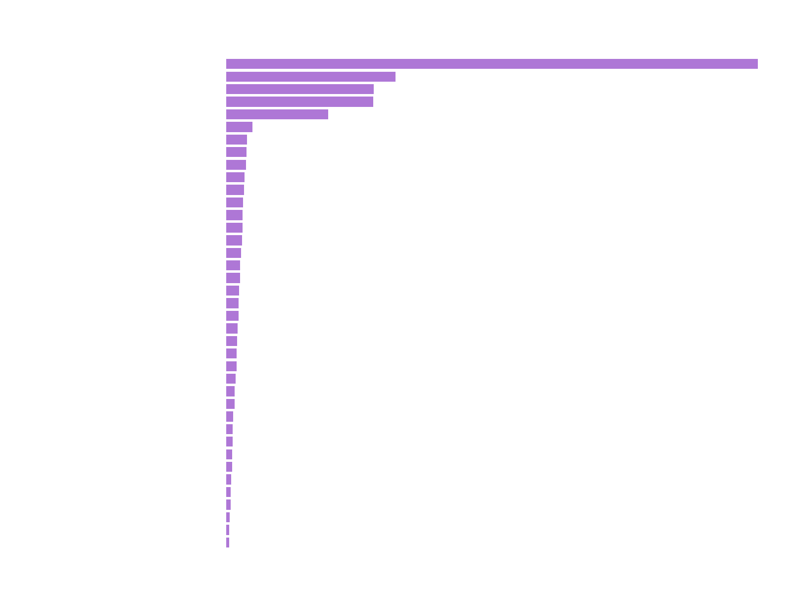
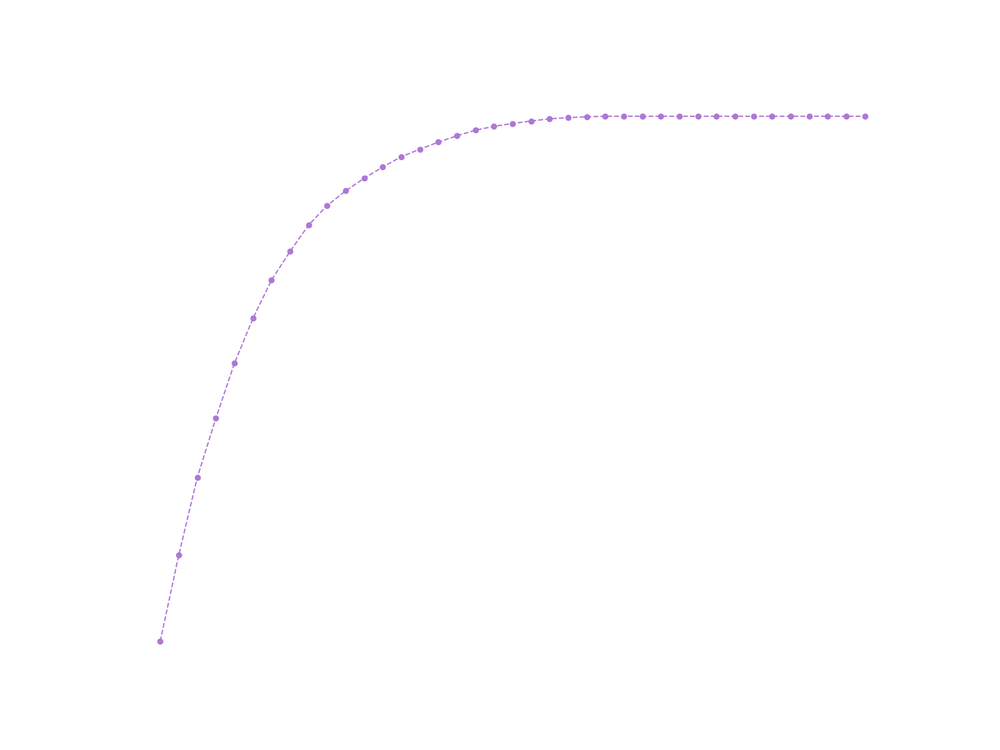
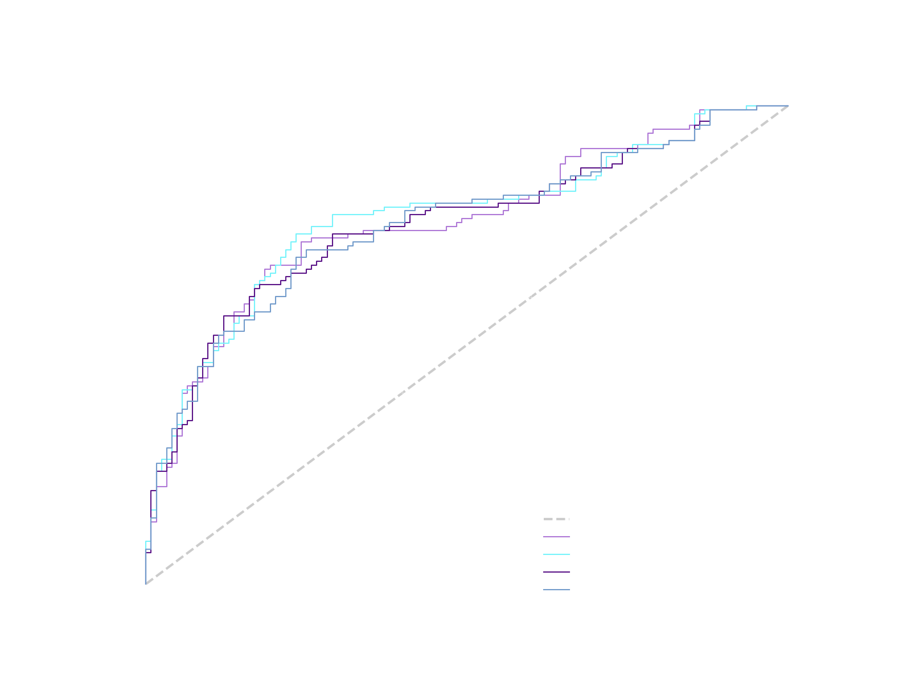
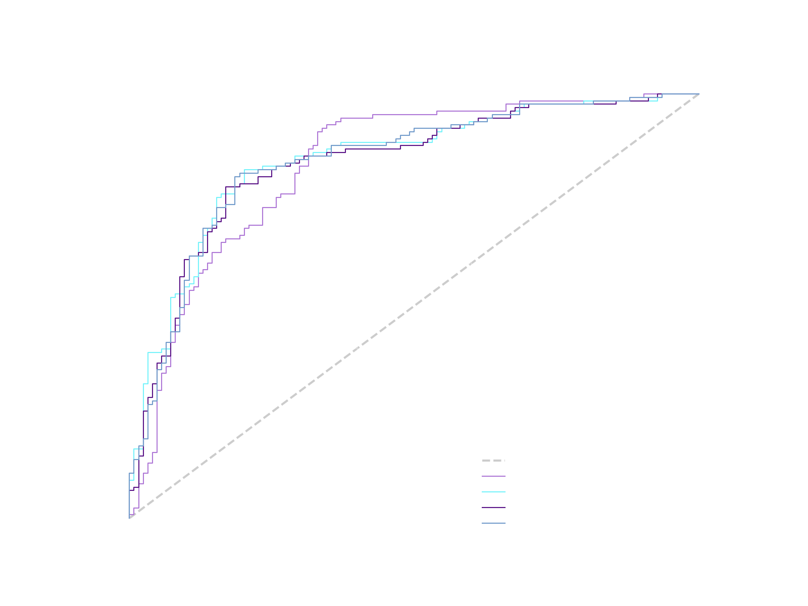
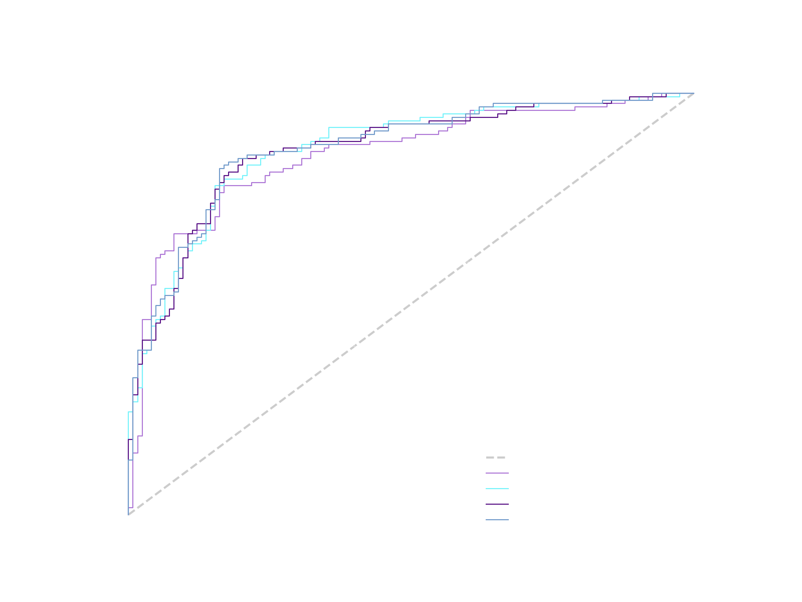

# CancerQML

This is a repository related to a project done with the QubiTo team (of Politecnico di Torino) that presents quantum machine learning model training aimed at predicting breast cancer.

### Possible purposes

The main purpose of a model like this is to predict the status of a patient. By analyzing various parameters related to a patient, the model can provide an estimate of the likelihood of the patient having breast cancer. This information can be valuable for medical staff when making decisions about whether to intervene or not on patients upon their parameter's values.

### Dataset
The dataset used was obtained from [Kaggle](https://www.kaggle.com/datasets/reihanenamdari/breast-cancer). It concerned the correct prediction of breast cancer in various patients.

### Feature importance analysis
We firstly analyzed the relative importance of the features since we had limited power to simulate quantum hardware. We chose to use a range of 8 to 12 qubits, so 8 to 12 features.
We obtained the following:

We then produced different datasets.

### Downsampling and PCA
We tried to perform random downsampling to make the classes balanced, obtaining a 1:1 dataset. We also tried exploring the possibility of reducing degrees of freedom applying principal component analysis, and cutting the number of features according to that. We obtained, acting on the downsampled dataset:

We so discarded all features but the first 10, retaining a good amount of variance.

### Training the models

Before training the dataset was split as usual into three sets: Train, Validation and Test.

We then trained the quantum model considering the top 8 to 12 features, to explore different behaviours. Notice that we used only downsampled datasets.
We used [Pennylane QML libraries](https://pennylane.ai) with the following options:
- angle encoding;
- strongly entangling layer (amount of layers  varying between 5 to 20).

The classical model was trained in different ways. (TODO: to be completed).

### Metric

To optimize the performance of our classifier, we decided to focus on maximizing the Area Under Curve (AUC) of the Receiver Operating Characteristic (ROC) curve. This curve is created by plotting the True positive rate (TPR) against the False positive rate (FPR). By maximizing the AUC, we can provide professionals the best curve to then choose, setting a threshold, to maximize either accuracy or precision, depending on the specific requirements of our application.

### Results

Now we propose the main results obtained.
We started with 10 features, downsampling and pca:

Then we tried without pca and the result was better:

In the end we used 8 features instead of 10 and we obtained the best result:

### Conclusion

Classical or quantum?
